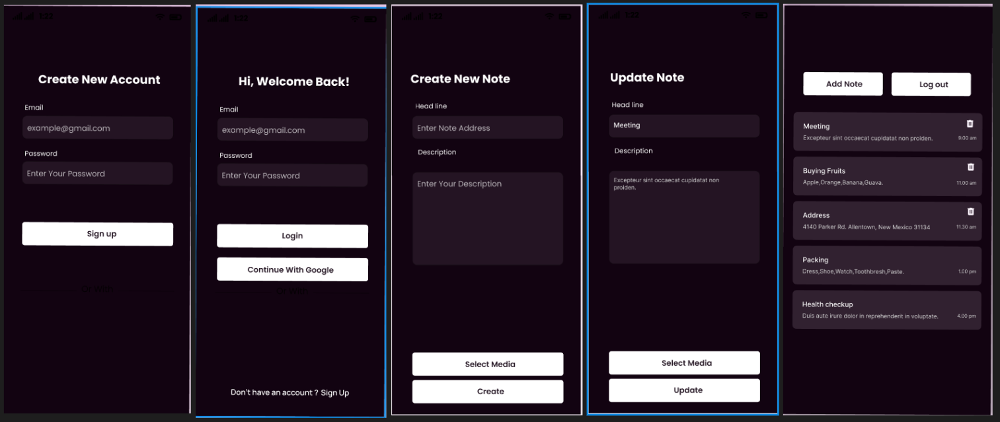

# 📝 Sync Notes
> An offline-first note-taking application with real-time cloud synchronization, built with Flutter and powered by Hive + Firebase.


## 📱 Screenshots
| Notes List | Create Note | Dark Mode |
|------------|-------------|-----------|
|  |  |  |
## 🏗️ Architecture
lib/ ├── core/ │ ├── themes/ # Light & Dark theme configurations │ ├── constants/ # App-wide constants │ └── utils/ # Helper functions ├── data/ │ ├── models/ # Note model with toJson/fromJson │ ├── local/ # Hive/SQLite data source │ └── remote/ # Firebase/Supabase data source ├── logic/ │ └── cubit/ # NotesCubit, ThemeCubit ├── presentation/ │ ├── screens/ # Home, Create, Edit, Search screens │ └── widgets/ # Reusable UI components └── main.dart

 
## 🔧 Tech Stack

| Category | Technology |
|----------|-----------|
| **Framework** | Flutter 3.x |
| **State Management** | BLoC / Cubit |
| **Local Storage** | Hive / SQLite |
| **Cloud Sync** | Firebase Firestore |
| **Architecture** | Clean Architecture |
| **Theming** | Material Design 3 |

## ✨ Key Features

- ✅ **Offline-First**: Full functionality without internet connection
- ✅ **Cloud Sync**: Automatic synchronization when connectivity is restored
- ✅ **Zero Data Loss**: Conflict resolution ensures no notes are ever lost
- ✅ **Search & Filter**: Instant search across all notes with optimized indexing
- ✅ **Dark/Light Theme**: Smooth theme switching with system preference support
- ✅ **Rich Text**: Support for formatted notes with categories and colors
- ✅ **CRUD Operations**: Create, Read, Update, Delete with undo support

## 📊 Performance

- 📱 Handles 1000+ notes with smooth scrolling
- ⚡ < 500ms sync latency when connectivity restored
- 💾 Efficient local storage with Hive (NoSQL, zero-overhead)
- 🔄 Background sync without blocking UI

## 🏃 Getting Started

```bash
# Clone
git clone https://github.com/asherifo/sync-notes.git
cd sync-notes

# Install dependencies
flutter pub get

# Run
flutter run
